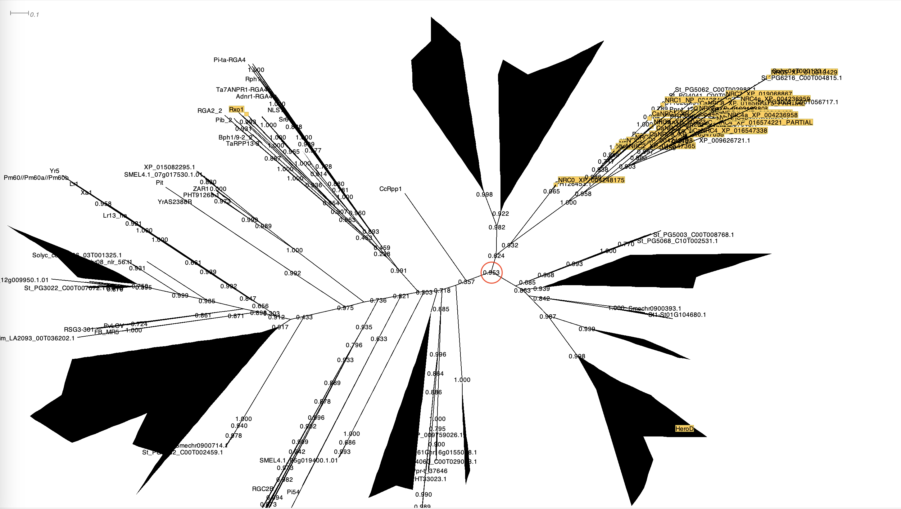
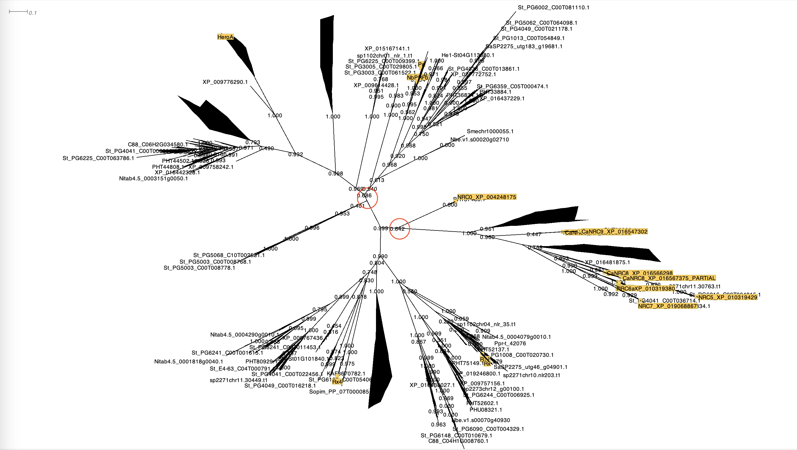
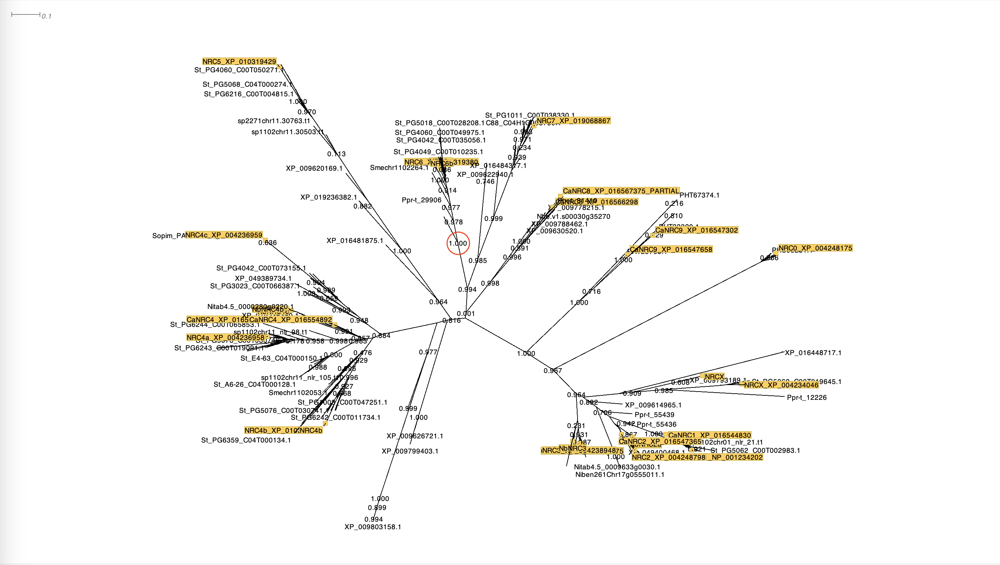
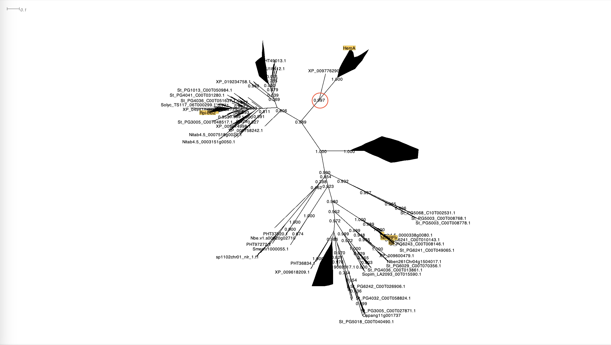

Use the produced tree of all CC-type NLRs to extract the NRC clade, NRC helpers, NRC6 subclade, and Hero clade from SD-type sensors.

1. Identify and extract the NRC superclade based on the presence of the reference helpers and sensors. we did it using *Dendroscope* (Options > Advanced Options > Extract Subnetwork...)

2. Realign the extracted clade in the same way as described earlier and remake a new phylogenetic tree. Extract the NRC helper clade and NRC SD-type sensor clade using the same method.

3. Do the same to extract the NRC6 and Hero subclades from NRC helper and NRC SD-type sensor clades, respectively.

NRC6:

Hero Clade:

* Phylogenetic trees marked as "_i2.newick" in *data*(Hero/data) are based on the realigned sequences.
